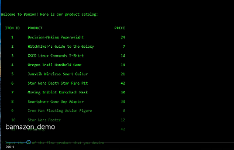

# Bamazon!

## What the project does
This is an implementation of the Bamazon project, done as homework for the February 2018 UNC Coding Boot Camp. When complete, it will be a database-backed storefront application with a command line interface.

As you can see when you run the app, our products will appeal to a wide swath of the audience that is comfortable with using a command line app. 

## How to get started with the application
You must have MySQL installed on your computer. Once you have it ready, download the application from GitHub. In a terminal window, enter ('$' is the prompt):

	$ mysql -u <user name> -p < bamazonSeed.sql
	
and then enter your password. If your user account does not require a password (bad security for the real world, but OK for homework), omit the '-p'. This will create an instance of the Bamazon database and populate it with some product data.

Click on the image below for a video that shows the application in use.

To start shopping, a customer would enter:

	$ node bamazonCustomer.js

and the application displays Bamazon's catalog. The customer enters product ID and quantity desired in response to prompts. If there is enough in stock, we make the sale. If not, we tell that to the customer and stop.

A manager would enter:

	$ node bamazonManager.js

and the application offers the option of viewing the product catalog (with quantity in stock added), identify low inventory items, increase inventory and add a new product. Once the manager choses one and completes the task, the application ends. Future development will keep the application running until the manager decides to quit.

## Authors
This application was built and will be maintained by Mark Hainline. Help beyond this README should not be needed, and will not be available.
